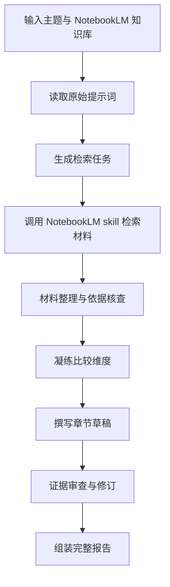

# Agent Instructions

## Scope Boundary

This agent may only operate inside the current project directory.

- Do not read, copy, modify, or infer from files in parent or sibling directories.
- Use relative paths only when referring to project files.
- Codex skills may be called and their instructions may be viewed when relevant.
- The NotebookLM skill may be called as a capability, but must not be modified.

## Project Goal

Build an automated international policy comparison report writing workflow based on the NotebookLM skill.

The intended workflow takes two core inputs:

1. A selected policy topic.
2. The corresponding NotebookLM knowledge base or notebook.

From these inputs, the workflow should use materials in the NotebookLM knowledge base to produce a complete international policy comparison report.

NotebookLM is the knowledge and source-traceability boundary. The agent may orchestrate retrieval, structuring, drafting, review, and assembly, but must not invent policy facts that are not supported by the NotebookLM knowledge base or approved project materials.

## Prompt Material Boundary

The directory `多政策的国际比较报告` stores the original writing prompts for this workflow.

Rules for this directory:

- The agent may read these prompt files.
- The agent may copy content from these prompt files into derived workflow files.
- The agent must not directly modify the original prompt files.
- If a prompt file needs to be changed, the agent must first ask for user approval and clearly state the proposed change.

## Workflow Design Principles

The workflow should be built from the existing original prompts in `多政策的国际比较报告`.

The expected report-generation flow should include, at minimum:

1. Topic intake: receive the selected report topic and NotebookLM knowledge base identifier.
2. Chapter planning: determine the report structure and chapter-level tasks.
3. Material retrieval: use NotebookLM-backed retrieval to collect relevant policy materials from the knowledge base.
4. Structured extraction: organize retrieved materials by country, institution, policy file, year, policy measure, and source evidence.
5. Dimension building: derive comparison dimensions from the retrieved materials instead of imposing unsupported preset categories.
6. Section drafting: write Chinese policy-report prose using only supported materials.
7. Evidence checking: verify that claims, files, years, institutions, and measures are traceable to retrieved materials.
8. Report assembly: combine chapter drafts into a complete international policy comparison report.
9. Review and revision: identify unsupported claims, missing evidence, structure gaps, and style inconsistencies.

When useful, workflow explanations may use Mermaid flowcharts.

Example:

## Evidence Rules

- Use only materials retrieved from the provided NotebookLM knowledge base or explicitly approved project files.
- Do not supplement facts from memory, web search, or unsupported assumptions.
- If a source does not provide a field, mark it as missing rather than inventing it.
- Each concrete policy measure should be traceable to a source file, source body, and year when available.
- Keep retrieval outputs, extraction outputs, evidence matrices, drafts, review reports, and final reports auditable.

## Writing Rules

- Write final report content in Chinese unless the user requests otherwise.
- Use objective, formal policy-research prose.
- Preserve original policy file names, institution names, years, and source labels accurately.
- Do not use subjective phrases such as "我认为" unless the user explicitly asks for personal analysis.
- Comparison dimensions must grow from the retrieved materials.
- When writing code, add clear Chinese comments and Chinese explanations for non-obvious workflow logic.

## File Handling Rules

- Use relative paths in documentation, prompts, configs, and user-facing explanations.
- Do not alter files in `多政策的国际比较报告` without prior user approval.
- New workflow files should be created outside the original prompt files unless the user approves otherwise.
- Keep generated artifacts clearly separated from original prompts, for example under a future directory such as `workflow`, `runs`, or `outputs`.

## Response Rules

When answering questions about the workflow:

- Explain the process concretely and tie it back to the NotebookLM boundary.
- Use Mermaid flowcharts when they help clarify sequence, branching, or module relationships.
- State assumptions and source boundaries explicitly.
- If the requested operation would require modifying original prompt files, ask for approval before editing.
