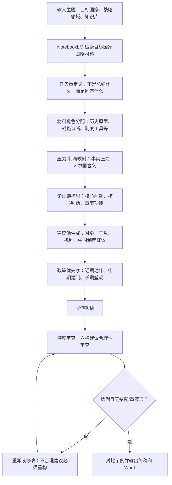

# 战略应对型政策文章工作流设计

## 1. 工作流定位

本工作流用于生成“目标国家战略分析 + 中国应对策略建议”类型文章。

它不是某一主题的定制脚本，而是面向如下通用输入：

```yaml
topic: "中美AI人才竞争及应对策略"
target_country: "美国"
strategy_domain: "AI人才"
notebook_name: "中美人才"
china_response_focus: "中国AI人才培养、储备、引进与战略应对"
```

## 2. 通用逻辑



## 3. 提示词模块

- 检索：从 NotebookLM 获取战略背景、措施、机制、意图、中国短板、应对依据。
- 任务重定义：明确本文不是总结什么，而是在回答什么。
- 材料角色分配：判断每类材料在论证链里证明什么。
- 压力-判断映射：把事实压力转化为作者判断和中国政策问题。
- 论证链构思：形成核心问题、核心判断、章节功能和建议推导路径。
- 建议池生成：先形成候选建议，再检查对象、工具、机制和制度载体。
- 政策优先序：区分近期动作、中期制度建设和长期规则布局。
- 写作：生成可直接入稿的政策文章正文。
- 审查：与示例标准对照，重点审查建议是否合理。
- 修改：根据审查报告重写或修改，错配建议必须重构。

## 4. 示例文章抽象结构

详见：

- `source/template_extraction.md`
- `templates/article_template.md`

核心结构：

1. 标志性政策事件引入。
2. 目标国家战略措施拆解。
3. 战略意图与历史/制度解释。
4. 对中国形成的压力判断。
5. 中国体系化应对建议。

## 5. 运行方式

```bash
python3 strategic_response_workflow/workflow/runner.py \
  --topic "中美AI人才竞争及应对策略" \
  --target-country "美国" \
  --strategy-domain "AI人才" \
  --notebook-name "中美人才" \
  --china-response-focus "中国AI人才培养、储备、引进与战略应对"
```
