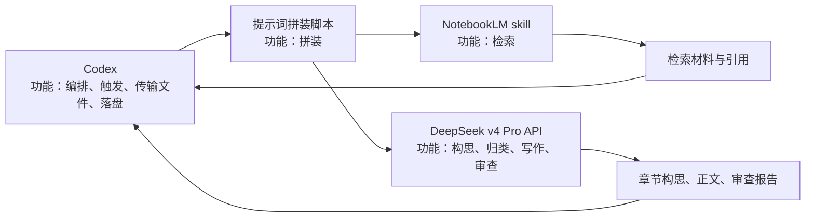
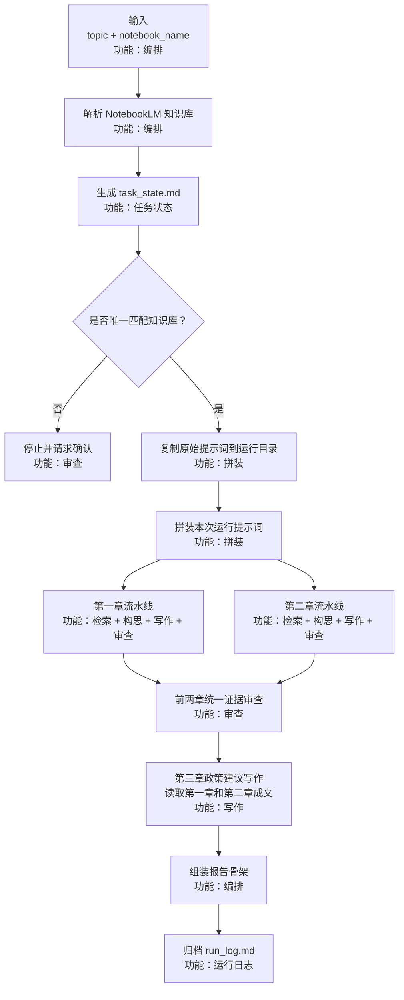
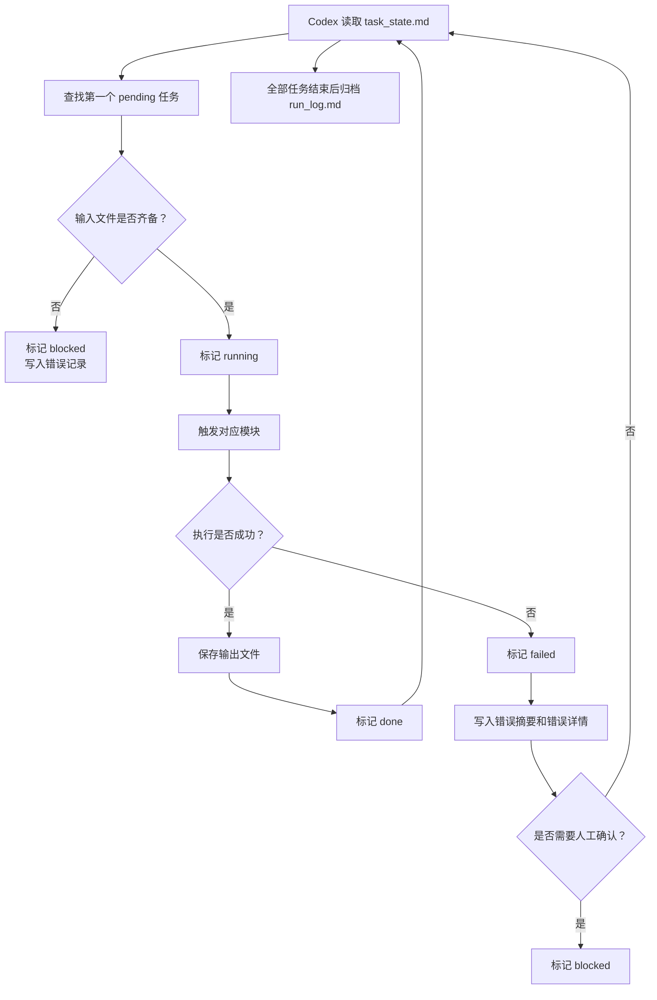
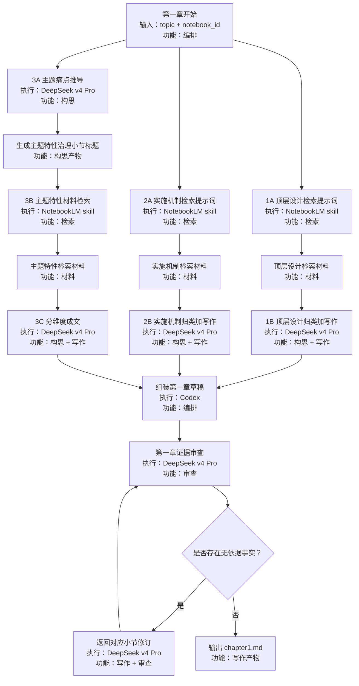
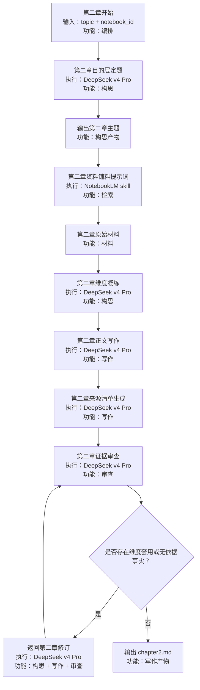
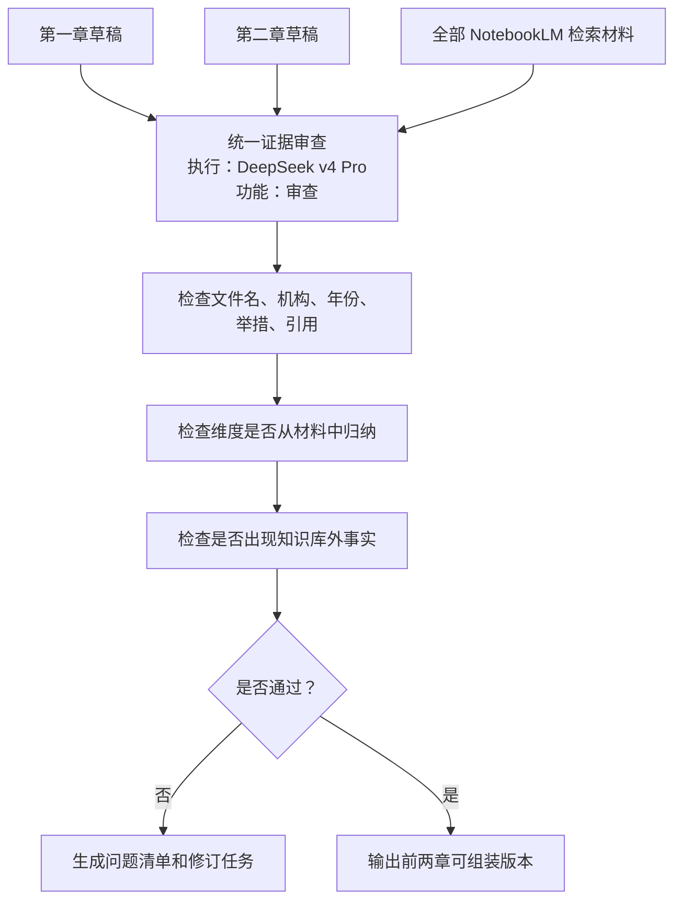
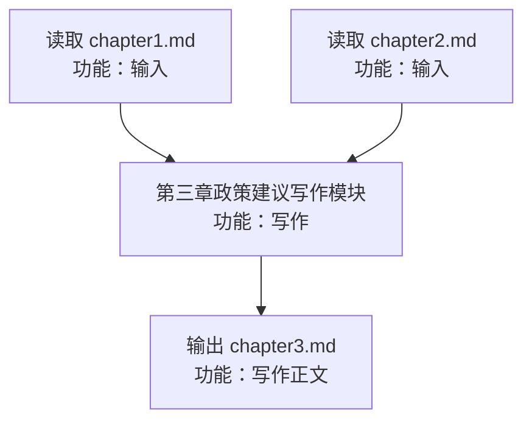

# 工作流流程图

## 1. 角色分工

说明：

- Codex 不直接承担知识判断，主要负责触发流程、传递文件、保存产物、串联模块。
- NotebookLM skill 只负责把工程化检索提示词传给指定知识库，并返回材料与引用。
- DeepSeek v4 Pro 负责 3A、1B、2B、3C、第二章构思、第二章写作和审查。
- DeepSeek 的思考过程不保存、不展示，只保存最终回答。

## 2. 总体流程

## 2.1 Codex 调度与任务状态

## 3. 第一章流程

第一章回答“各国如何治理该领域”，由“通用治理骨架”和“主题特性治理机制”组成。

第一章模块清单：

| 模块 | 功能 | 执行者 | 输入 | 输出 |
| --- | --- | --- | --- | --- |
| 1A 顶层设计检索 | 检索 | NotebookLM skill | `topic`、`notebook_id`、1A 工程化提示词 | 顶层设计材料 |
| 2A 实施机制检索 | 检索 | NotebookLM skill | `topic`、`notebook_id`、2A 工程化提示词 | 实施机制材料 |
| 1B 顶层设计归类加写作 | 构思、写作 | DeepSeek v4 Pro | 1A 材料、1B 工程化提示词 | 顶层设计小节 |
| 2B 实施机制归类加写作 | 构思、写作 | DeepSeek v4 Pro | 2A 材料、2B 工程化提示词 | 实施机制小节 |
| 3A 主题痛点推导 | 构思 | DeepSeek v4 Pro | `topic`、3A 工程化提示词 | 主题特性治理标题 |
| 3B 主题特性检索 | 检索 | NotebookLM skill | 主题特性标题、`notebook_id`、3B 工程化提示词 | 主题特性材料 |
| 3C 分维度加写作 | 构思、写作 | DeepSeek v4 Pro | 3B 材料、3C 工程化提示词 | 主题特性治理小节 |
| 第一章审查 | 审查 | DeepSeek v4 Pro | 第一章草稿、全部检索材料 | 审查报告和修订建议 |

## 4. 第二章流程

第二章回答“该领域最终要达成什么”，先构思目的层主题，再通过 NotebookLM 获取材料，最后由 DeepSeek 完成维度凝练和写作。

第二章模块清单：

| 模块 | 功能 | 执行者 | 输入 | 输出 |
| --- | --- | --- | --- | --- |
| 第二章目的层定题 | 构思 | DeepSeek v4 Pro | `topic`、第二章定题工程化提示词 | 第二章主题 |
| 第二章资料铺料 | 检索 | NotebookLM skill | 第二章主题、`notebook_id`、资料铺料工程化提示词 | 逐主体材料 |
| 第二章维度凝练 | 构思 | DeepSeek v4 Pro | 资料铺料结果、凝练维度工程化提示词 | 2-4 个比较维度 |
| 第二章正文写作 | 写作 | DeepSeek v4 Pro | 资料铺料结果、维度清单、写作约束 | 第二章正文 |
| 第二章审查 | 审查 | DeepSeek v4 Pro | 第二章草稿、第二章材料 | 审查报告和修订建议 |

## 5. 前两章统一审查

## 6. 第三章政策建议写作

第三章读取第一章和第二章成文内容，由 DeepSeek v4 Pro 生成面向中国问题的政策建议。

当前确定边界：

- 第三章必须读取第一章和第二章成文内容。
- 第三章遵循“从国际经验中来、到中国问题中去”的转化逻辑。
- 第三章不新增无前文依据的国外案例。
