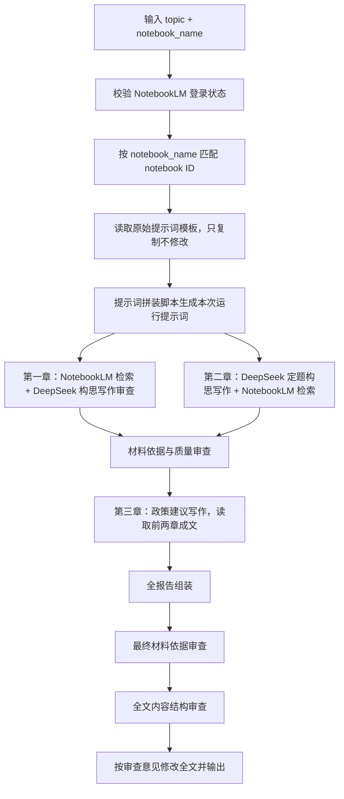

# 国际政策比较报告自动写作工作流设计

## 1. 输入契约

工作流只接收两个必填输入：

```yaml
topic: "人工智能+教育"
notebook_name: "AI教育国际政策知识库"
```

字段含义：

- `topic`：本次国际政策比较报告的主题，用于替换原始提示词中的`【主题】`、`【本次主题】`、`【本章主题】`等占位符。
- `notebook_name`：NotebookLM 中的知识库名称。工作流需要先用该名称匹配 NotebookLM notebook，并解析出后续调用所需的 notebook ID。

后续代码实现时，可以允许增加可选配置，但核心入口必须保持为“主题 + NotebookLM 知识库名称”。

## 2. 执行者分工

| 执行者 | 职责 | 边界 |
| --- | --- | --- |
| Codex | 触发流程、传输文件、创建运行目录、保存产物、组装报告骨架 | 不直接修改原始提示词，不承担知识补写 |
| 提示词拼装脚本 | 复制原始提示词、替换主题、拼装模块输入 | 只处理运行目录中的提示词副本 |
| NotebookLM skill | 检索知识库材料并返回回答和引用 | 只调用，不修改；只负责材料获取 |
| DeepSeek v4 Pro API | 负责构思、归类、写作、审查 | 不保存思考过程，只保存最终回答 |

## 3. 总体流程



核心原则：

- NotebookLM 是唯一的知识检索边界。
- 原始提示词只读，不直接修改。
- DeepSeek v4 Pro 负责构思、归类、写作、审查。
- 每一次 NotebookLM 检索、归类、写作和审查都要留下运行产物。
- 如果知识库没有覆盖某项事实，输出中必须标记缺失，不能补写。

## 4. 运行目录

每次生成报告时创建一个独立运行目录：

```text
runs/
  2026-06-04_ai-education/
    input.yaml
    task_state.md
    run_log.md
    notebook_resolution.md
    generated_prompts/
    retrieval_outputs/
    extracted_materials/
    chapter_drafts/
    review_reports/
    final_report.md
    manifest.md
```

各目录职责：

- `input.yaml`：保存本次输入的主题和 NotebookLM 知识库名称。
- `task_state.md`：运行中的临时任务列表，记录每个流程节点的状态、输入、输出和错误。
- `run_log.md`：运行结束后的归档日志，记录任务完成情况、错误记录、重试和最终产物。
- `notebook_resolution.md`：保存知识库名称、匹配到的 notebook ID、匹配方式和校验状态。
- `generated_prompts/`：保存由原始提示词复制并替换主题后的本次运行提示词。
- `retrieval_outputs/`：保存 NotebookLM 的原始问答或检索结果。
- `extracted_materials/`：保存结构化抽取结果。
- `chapter_drafts/`：保存各章草稿。
- `review_reports/`：保存审查报告。
- `final_report.md`：完整报告。
- `manifest.md`：列出所有产物、生成顺序和来源说明。

## 5. NotebookLM 边界

工作流可以调用 NotebookLM skill，但不能修改 NotebookLM skill。

建议调用策略：

1. 运行前检查认证状态。
2. 使用 NotebookLM 列表能力获取 notebook 列表。
3. 用 `notebook_name` 精确匹配 notebook；如果精确匹配失败，再进行唯一模糊匹配。
4. 后续所有 NotebookLM 调用都显式传入 notebook ID，避免依赖全局上下文。
5. 检索类调用优先保留引用标记，便于后续核查。

名称匹配规则：

- 如果没有匹配到 notebook，停止工作流并提示用户检查知识库名称。
- 如果匹配到多个 notebook，停止工作流并列出候选名称，请用户确认。
- 只有匹配到唯一 notebook 后，才进入报告生成阶段。

## 6. DeepSeek 边界

DeepSeek v4 Pro API 负责以下模块：

- 3A 主题痛点推导：构思。
- 1B 顶层设计归类加写作：构思、写作。
- 2B 实施机制归类加写作：构思、写作。
- 3C 主题特性分维度加写作：构思、写作。
- 第二章目的层定题：构思。
- 第二章凝练维度与成文：构思、写作。
- 第一章、第二章和前两章统一审查：审查。
- 全文内容结构审查：审查。
- 按全文审查意见修改完整报告：写作/修改。

DeepSeek 调用约束：

- 配置从 `.env` 读取。
- 模型使用 `DEEPSEEK_MODEL`。
- 不保存、不展示、不写入 `reasoning_content`。
- 只保存最终回答 `content`。

## 7. 原始提示词到工作流模块的映射

原始提示词目录：

```text
多政策的国际比较报告/
  第一章提示词/
  第二章提示词/
```

这些文件只允许读取和复制，不允许直接修改。

模块映射：

| 工作流模块 | 原始提示词来源 | 产物 |
| --- | --- | --- |
| 第一章-顶层设计检索 | `多政策的国际比较报告/第一章提示词/1A：顶层设计 - 检索` | `retrieval_outputs/chapter1_top_design.md` |
| 第一章-实施机制检索 | `多政策的国际比较报告/第一章提示词/2A：实施机制-检索` | `retrieval_outputs/chapter1_implementation.md` |
| 第一章-顶层设计成文 | `多政策的国际比较报告/第一章提示词/模块 1B：顶层设计 · 归类加写作` | `chapter_drafts/chapter1_top_design.md` |
| 第一章-实施机制成文 | `多政策的国际比较报告/第一章提示词/2B：实施机制 · 归类` | `chapter_drafts/chapter1_implementation.md` |
| 第一章-主题特性定题 | `多政策的国际比较报告/第一章提示词/3a 主题痛点` | `extracted_materials/chapter1_topic_specific_title.md` |
| 第一章-主题特性检索 | `多政策的国际比较报告/第一章提示词/3b 检索` | `retrieval_outputs/chapter1_topic_specific.md` |
| 第一章-主题特性成文 | `多政策的国际比较报告/第一章提示词/3c 分维度加写作` | `chapter_drafts/chapter1_topic_specific.md` |
| 第二章-目的层定题 | `多政策的国际比较报告/第二章提示词/第二部分定题.md` | `extracted_materials/chapter2_topic.md` |
| 第二章-资料铺料 | `多政策的国际比较报告/第二章提示词/第二章所需资料提示词.md` | `retrieval_outputs/chapter2_materials.md` |
| 第二章-凝练维度与成文 | `多政策的国际比较报告/第二章提示词/第二章凝练维度写作模版.md` | `chapter_drafts/chapter2.md` |
| 第三章-政策建议写作 | `workflow/prompts/ch3_writing.md` | `chapter_drafts/chapter3.md` |
| 全文内容结构审查 | `workflow/prompts/fulltext_review.md` + `workflow/review_templates/content_structure_review.md` | `review_reports/fulltext_content_structure_review.md` |
| 全文内容结构修改 | `workflow/prompts/fulltext_rewrite.md` + 全文审查报告 | `final_report_reviewed.md` |

## 8. 阶段设计

### 8.1 初始化阶段

输入：

- `topic`
- `notebook_name`

处理：

1. 保存 `input.yaml`。
2. 建立运行目录。
3. 生成 `task_state.md` 临时任务列表。
4. 检查 NotebookLM 登录状态。
5. 解析 `notebook_name` 对应的 notebook ID。
6. 将初始化状态写入 `task_state.md`。

输出：

- `input.yaml`
- `task_state.md`
- `notebook_resolution.md`

### 8.2 提示词生成阶段

处理：

1. 读取原始提示词。
2. 复制到 `generated_prompts/`。
3. 将主题占位符替换为本次 `topic`。
4. 为每个提示词补充本次运行的 NotebookLM notebook ID 和证据约束。

输出：

- `generated_prompts/*.md`

注意：

- 这里只生成副本，不修改 `多政策的国际比较报告` 中的原始文件。

### 8.3 第一章生成阶段

第一章主题：各国如何治理该领域。

建议结构：

1. 顶层设计与实施机制。
2. 主题特性治理机制。

处理顺序：

1. 用“顶层设计检索”提示词调用 NotebookLM，产出顶层设计素材。
2. 用“实施机制检索”提示词调用 NotebookLM，产出实施机制素材。
3. 基于顶层设计素材调用 DeepSeek，生成“顶层设计的主要类型”。
4. 基于实施机制素材调用 DeepSeek，生成“实施机制的主要类型”。
5. 用“主题痛点”提示词调用 DeepSeek，推导主题特性小节标题。
6. 用主题特性标题调用 NotebookLM 检索相关材料。
7. 基于主题特性材料调用 DeepSeek，分维度成文。
8. 调用 DeepSeek 审查第一章证据支撑。

输出：

- `retrieval_outputs/chapter1_top_design.md`
- `retrieval_outputs/chapter1_implementation.md`
- `retrieval_outputs/chapter1_topic_specific.md`
- `chapter_drafts/chapter1_top_design.md`
- `chapter_drafts/chapter1_implementation.md`
- `chapter_drafts/chapter1_topic_specific.md`
- `chapter_drafts/chapter1.md`

### 8.4 第二章生成阶段

第二章主题：该领域的目的层。

处理顺序：

1. 用“第二部分定题”提示词调用 DeepSeek，从 `topic` 推导第二章主题。
2. 用第二章主题调用 NotebookLM 做资料铺料。
3. 基于铺料结果调用 DeepSeek，自下而上凝练 2-4 个横向比较维度。
4. 调用 DeepSeek 生成第二章正文和来源清单。
5. 调用 DeepSeek 审查第二章证据支撑。

输出：

- `extracted_materials/chapter2_topic.md`
- `retrieval_outputs/chapter2_materials.md`
- `chapter_drafts/chapter2.md`

### 8.5 第三章政策建议写作阶段

第三章主题：中国对策。

第三章读取第一章和第二章成文内容，基于前文国际比较结论进行综合转化写作。写作逻辑是“从国际经验中来、到中国问题中去”。

已确定边界：

1. 第三章必须读取第一章和第二章的成文内容。
2. 第三章不照搬国际做法，而是转化为面向中国问题的政策建议。
3. 第三章不新增前文完全没有依据的国外案例。

输出：

- `generated_prompts/ch3_writing.md`
- `chapter_drafts/chapter3.md`

待确认事项：

- 是否需要补充中国现状与差距的专门材料输入。

### 8.6 审查与全文修改阶段

每章生成后先执行材料依据审查。完整报告组装后，再执行全文内容结构审查和全文修改。

材料依据审查项目：

- 文件名、机构名、年份是否能在检索结果中找到。
- 具体政策举措是否有来源支撑。
- 是否出现知识库之外的国家、文件或政策事实。
- 是否把多份文件混为一谈。
- 是否存在“未见”字段被补写。
- 维度是否由材料归纳而来，而不是预设套用。
- 中文报告语体是否统一。

全文内容结构审查项目：

- 全文主题是否稳定。
- 第一章、第二章、第三章是否各自承担清楚功能。
- 比较维度是否同层、可比、有判断。
- 段落之间是否存在跳跃、重复或断裂。
- 第三章政策建议是否回应前文并落到中国问题。
- 总结段、小结段是否有基于材料的提炼。
- 语言是否庄重凝练，避免明显 AI 味和空泛表达。

输出：

- `review_reports/chapter1_review.md`
- `review_reports/chapter2_review.md`
- `review_reports/final_review.md`
- `review_reports/fulltext_content_structure_review.md`
- `final_report_reviewed.md`

## 9. 材料依据记录

当前阶段不要求模型输出结构化证据矩阵。

更轻的做法是：

1. 检索模块保留“检索内容”和“相关文献”两块自然文本。
2. 写作模块在正文中保留来源线索，如文件名、年份、来源主体或引用标记。
3. 审查模块基于草稿和检索材料做自然语言问题清单。
4. 后续如果需要结构化，再由脚本从这些自然文本产物中抽取。

## 10. 任务状态与运行日志

每次启动工作流时，都要在运行目录中生成 `task_state.md`。

Codex 是调度者，负责：

1. 查看 `task_state.md`。
2. 找到下一个待执行任务。
3. 触发 NotebookLM skill、DeepSeek API 或本地拼装模块。
4. 将每个流程的完成情况写回 `task_state.md`。
5. 将错误摘要和错误详情写回 `task_state.md`。
6. 工作流结束后，将最终任务状态归档到 `run_log.md`。

任务状态说明详见 `workflow/task_state.md`。

## 11. 最小可实现版本

第一版工作流建议先实现以下闭环：


第一版可以暂缓：

- 复杂的多轮修订。
- 可视化控制台。
- 批量主题运行。

但第一版必须保留：

- 原始提示词只读。
- NotebookLM notebook 名称解析。
- 每一步产物落盘。
- 临时任务列表可随时查看。
- 错误记录落到运行日志。
- 材料依据审查。
- 缺失材料不补写。

## 12. 后续代码实现建议

建议先实现以下模块：

```text
workflow/
  workflow_design.md
  runner.py
  notebooklm_client.py
  prompt_builder.py
  report_pipeline.py
  task_state.py
  evidence_checker.py
```

代码注释和说明应使用中文，尤其是以下位置：

- NotebookLM 名称匹配逻辑。
- 原始提示词复制和占位符替换逻辑。
- 临时任务列表生成和状态更新逻辑。
- 检索结果到结构化材料的转换逻辑。
- 材料依据校验逻辑。
- 缺失材料处理逻辑。

## 13. 开放问题

后续需要确认：

1. `notebook_name` 是否要求精确匹配，还是允许唯一模糊匹配。
2. 第三章是否需要新增专门提示词。
3. 最终报告是否固定为三章，还是允许按主题自动调整小节。
4. NotebookLM 返回结果先保存为 Markdown，后续是否再做结构化。
5. 是否需要一个人工确认节点，在第二章主题和第一章主题特性标题确定后再继续。
