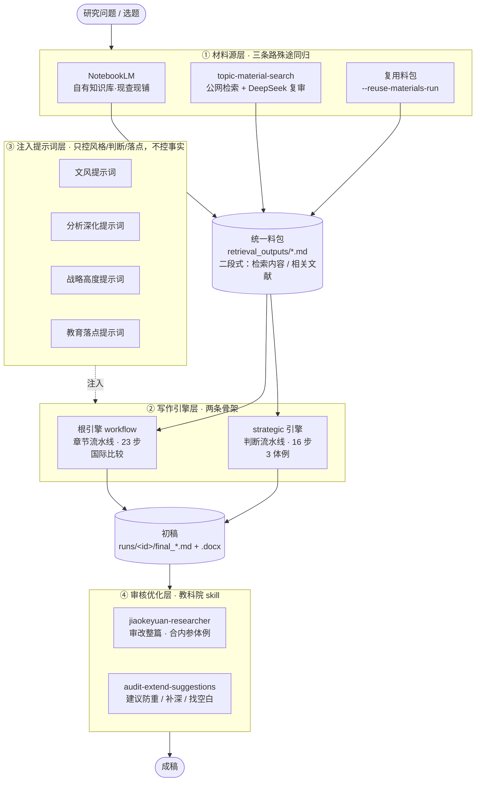
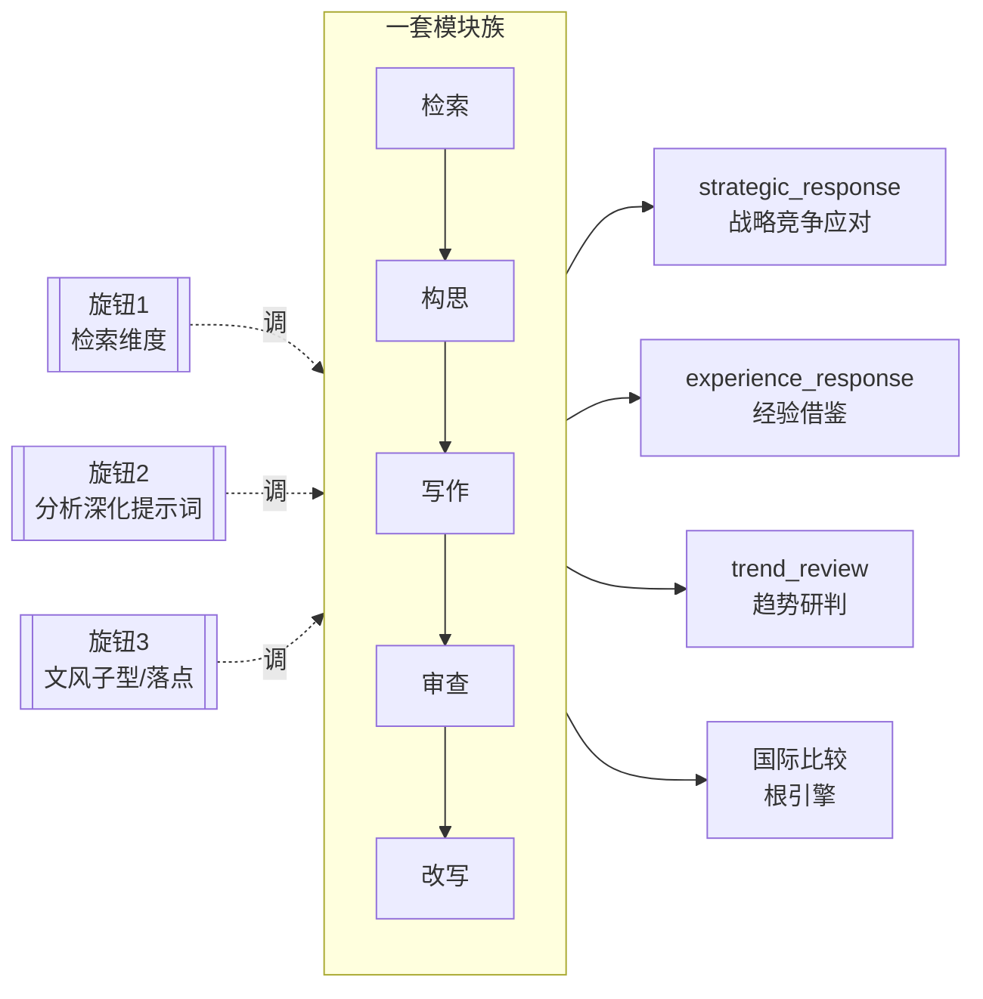
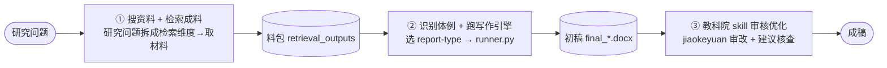
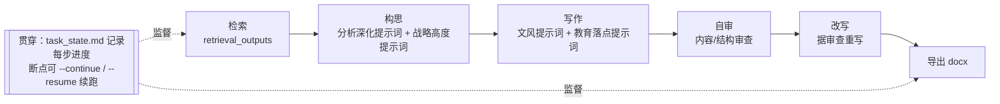

# 政策报告智能写作工作流 · 汇报方案（含架构图与流程图）

> 用途：本文档是 PPT 汇报的**内容底稿 + 核心图解**。可直接喂给 PPT 生成软件（Gamma / Marp / Slidev / 讯飞智文 等）——第三部分「逐页内容」按 `---` 分页、标题即页标题；第二部分的 mermaid 图多数工具可直接渲染，或据文字说明重画。
> 汇报时长约 15–20 分钟，14 页。

---

## 一、汇报主线（一句话版）

**痛点**：政策内参报告（国际比较 / 经验借鉴 / 趋势研判）写作耗时，且要保证"内参体例 + 战略高度"，人工难标准化。
**方案**：把它做成一套**可复用工作流**——三条路取料 → 两台引擎 + 可插拔提示词写作 → 教科院 skill 审核优化 → 成稿。
**证据**：已跑近百次（根 20 + 战略 77 = 97 次），产出多篇成稿，含教科院修订版。

---

## 二、核心图解（重点：讲清楚这几张图）

### 图 1 · 系统架构图（四层）

**怎么读这张图**：从上到下四层。①材料无论来自自有库、公网还是复用，都收敛成**同一种料包格式**（这是解耦关键）；②两台引擎按题材二选一；③文风/判断/落点等提示词像"插件"注入引擎，只管怎么写、不碰写什么；④成稿再过教科院 skill 做体外精修。**一句话：材料标准化进、提示词可插拔、审核在体外。**

---

### 图 2 · 核心抽象：一套模块族 × 三个旋钮

**怎么读这张图**：所有体例共用同一套模块族（检索→构思→写作→审查→改写），真正区分它们的只有**三个旋钮**——往哪几维检索、用哪条分析深化提示词、按哪种文风/落点落笔。**一句话：不是每个体例各写一套，而是同一套靠三个旋钮排列组合出多个体例。**

---

### 图 3 · 使用全景流程图（四阶段）

**怎么读这张图**：这是"人怎么用"的主线——四步，左到右。搜资料和检索问题是一件事的两面（先拆维度、再取料）；识别体例=选对 report-type；最后一步是体外精修。**一句话：搜料 → 成料 → 选体例写 → 审核优化。**

---

### 图 4 · 引擎内部运行流程图（一次运行发生了什么）

**怎么读这张图**：`runner.py` 一条命令启动后，引擎内部自动跑这条流水；每步产物落盘、进度写进 `task_state.md`，中断能续跑。构思步注入"分析深化提示词+战略高度提示词"保推理深度与战略高度，写作步注入"文风提示词+教育落点提示词"保内参体例与教育域落点。**一句话：一条命令，内部自动走"检索→构思→写作→自审→改写→导出"，全程可断点续跑。**

---

## 三、逐页内容（PPT 生成用 · 按页分隔）

> 下面每个 `##` 是一页；要点即页面 bullet；「图」标注该页配哪张图；「讲」是口播提示。

---

### 第 1 页 · 封面
- **政策报告智能写作工作流**
- 副标题：国际比较 · 经验借鉴 · 趋势研判 —— 从选题到成稿的一条流水
- 汇报人 / 日期
- 讲：一句话点题——把政策内参报告的写作做成可复用工作流。

---

### 第 2 页 · 为什么做（痛点 → 方案）
- 痛点：内参报告写作耗时；要多国横向比较；还须守"内参体例 + 战略高度"；人工难标准化、难复用。
- 方案：三条路取料 → 两引擎 + 可插拔提示词写作 → 教科院 skill 审核优化。
- 讲：先立问题，再给出"工作流化"的解法。

---

### 第 3 页 · 架构总览
- 放【图 1】四层架构。
- 一句话标注每层：材料标准化 / 两引擎 / 提示词可插拔 / 审核在体外。
- 讲：全局一张图，后面各页展开。

---

### 第 4 页 · 核心抽象：模块族 × 三旋钮
- 放【图 2】。
- 要点：同一套模块族；三旋钮=检索维度 × 分析深化提示词 × 文风/落点；排列组合出多体例。
- 讲：这是"为什么一套能跑多种报告"的答案。

---

### 第 5 页 · 两种引擎
- 对比表：
  - 根引擎：章节流水线 · 23 步 · 国际比较（逐章横比多国）
  - strategic 引擎：判断流水线 · 16 步 · 3 体例（竞争应对 / 经验借鉴 / 趋势研判）
- 讲：两条骨架，按题材选。

---

### 第 6 页 · 使用方式：四阶段全流程
- 放【图 3】。
- 四步：搜资料 → 检索成料 → 识别体例写作 → 审核优化。
- 讲：这是"人怎么用"的主线。

---

### 第 7 页 · 材料从哪来（三条路）
- NotebookLM 自有库 / topic-material-search 公网检索+DS复审 / 复用料包。
- 三者汇聚到同一份二段式料包（文件名对齐体例检索维度）。
- 讲：来源灵活，出口统一——这是解耦点。

---

### 第 8 页 · 识别体例
- 判断表：国际比较→根引擎；竞争应对→strategic_response；经验借鉴→experience_response；趋势研判→trend_review；没有合适的→用 distill-report-module 从范文造新体例。
- 讲：选对体例，写作才对味。

---

### 第 9 页 · 引擎内部运行流程
- 放【图 4】。
- 检索→构思(分析深化提示词+战略高度提示词)→写作(文风提示词+教育落点提示词)→自审→改写→导出；task_state 断点续跑。
- 可配仪表盘截图 `workflow-prompt-dashboard.png`。
- 讲：一次运行内部发生了什么。

---

### 第 10 页 · 质量保障机制（怎么保证不是"AI 味"）
- 文风提示词 → 内参体例；分析深化提示词 → 分析深度；战略高度提示词 → 全局站位；教育落点提示词 → 落到教育域；自审+改写 → 兜底。
- 讲：这几件提示词就是"像人写、像内参"的秘诀。

---

### 第 11 页 · 审核优化层：教科院 skill
- jiaokeyuan-researcher：以教科院研究员范式审改整篇（补课题组署名、书面化措辞、收束判断、合内参体例）。
- audit-extend-suggestions：对策建议防重（查是否已有政策）/ 补深 / 找空白。
- 讲：引擎自审在体内，这一层在体外做人味精修。

---

### 第 12 页 · 成果①·旗舰
- 《人工智能+教育国际政策比较报告》（三审汇总修订版，约 9100 字）。
- 亮点：归纳出"专综并进型 / 总体嵌入型 / 专项引领型"三种治理类型；课题组署名；内参体例。
- 图：docx 首页 + 目录截图。
- 讲：完整成品长什么样。

---

### 第 13 页 · 成果②·审核优化前后对比 ⭐（重点页）
- 文章三《美国 AI 人才体系化竞争布局及我国教育领域应对策略》（strategic_response 体例）。
- 左右对比（修订前 vs 教科院修订版，改动标红）：
  - 加署名「人工智能人才竞争研究课题组」
  - "将给中国共产党制造'两难境地'" → 书面化 "将使中方陷入'两难境地'"
  - "NSCAI 报告直言" → 中性化 "NSCAI 报告称"
- 讲：教科院 skill 到底改了什么、价值在哪——这页最能打动人。

---

### 第 14 页 · 覆盖面 + 收尾
- 三体例各一篇：strategic=文章三；experience=《专业化优先·美英德澳体育教师》；trend=《终身教育》。
- 规模：已跑 97 次（根 20 + 战略 77）；文档集齐全（初始化/使用/驱动/移植）；支持跨平台移植（Windows）。
- 下一步：Win 部署上线、扩更多体例、材料源接入更多渠道。
- 图：三份成稿封面缩略 + 数据条。
- 讲：规模与成熟度，收束全场。

---

## 四、成果页素材清单（均在 `~/Desktop/成稿样例`）

| 用途 | 文件 |
|---|---|
| 旗舰成品（第12页） | `人工智能+教育国际政策比较报告_三审汇总修订版.docx` |
| 前后对比·前（第13页） | `文章三_美国AI人才体系化竞争布局及我国教育域应对策略_DeepSeek写+Claude_agent审_不联网.docx` |
| 前后对比·后（第13页） | `文章三…_教科院修订版.docx` |
| 经验借鉴体例（第14页） | `专业化优先_美英德澳体育教师经验及我国借鉴_教科院修订版.docx` |
| 趋势研判体例（第14页） | `终身教育-ds_教科院修订版.docx` |

> 仪表盘截图（第9页）：项目根 `workflow-prompt-dashboard.png` / `workflow-dashboard-chapter-detail.png`。

---

## 五、视觉与风格建议

- **配色**：深藏青（#1F3A5F）主色 + 暖金（#C8A45C）点缀，背景浅灰白；政务+技术双属性。
- **版式**：少字多图，每页 1 个核心信息 + 1 张图；命令/代码用等宽小字块，别整段贴。
- **图**：架构图/流程图用本文 mermaid（多数生成软件可渲染）；成果页放真实 docx 截图，前后对比用左右分栏 + 红字标改动。
- **节奏**：架构(3–5页) 快讲，使用+运行(6–11页) 是主体，成果(12–14页) 放慢、重点讲第 13 页前后对比。
